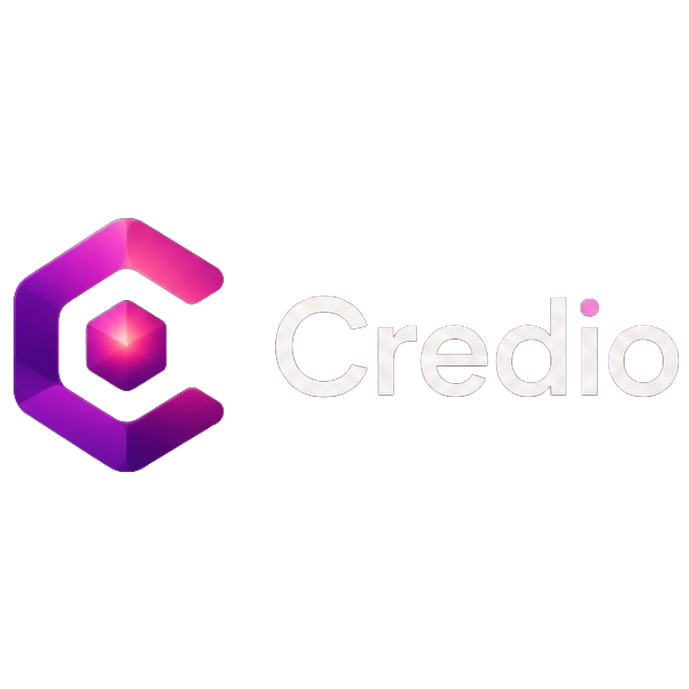

<div align="center">



# Credio SDK

**Credit liquidity for the agent economy.**

[](https://x402.org)
[](https://base.org)
[](./LICENSE)

[credio.cc](https://credio.cc) · [Docs](https://credio.cc/docs) · [Developers](https://credio.cc/developers)

</div>

AI agents pay per call via [x402](https://x402.org). When an agent's wallet runs dry, it stops. **Credio** is the credit layer that keeps it running: when your agent can't afford a paid x402 resource, Credio fronts the USDC, settles the real x402 payment, and hands over the resource. Your agent repays later to unlock a higher limit.

- **Non-custodial** — Credio never touches your keys.
- **Real x402** — genuine on-chain settlement in USDC on Base.
- **Gasless repayment** — pay back over x402 with no ETH required.
- **No API keys** — authentication is your Base wallet address.
- **Verified on-chain** — every payment and repayment is checked on-chain before debt changes.

---

## Install

```bash
npm i credio-sdk
```

Requires Node 18+ (uses the global `fetch`). Zero runtime dependencies.

---

## Quickstart

```ts
import { CredioClient } from "credio-sdk"

const credio = new CredioClient({ baseUrl: "https://credio.cc" })
const WALLET = "YOUR_BASE_WALLET_ADDRESS"

// Pay for an x402-protected resource with credit. Credio reads the 402,
// fronts the USDC, settles the payment, and returns the resource.
const res = await credio.payForResource({
  agentWalletAddress: WALLET,
  resourceUrl: "https://api.example.com/premium", // any x402 endpoint
  agentMetadata: { agentName: "My Agent" },
})

if (res.success) {
  console.log(res.resource?.body)               // the paid content
  console.log(res.settlementTx)                 // on-chain proof
  console.log(res.agentStatus?.currentUsdcDebt) // what you now owe
}
```

Credio pays the **provider directly**, it never sends funds to the agent. The agent receives the resource and a debt to Credio.

---

## Automatic fallback (recommended)

A credit line is only useful if it kicks in on its own. `withCredioFallback`
wraps your agent's fetch so it pays from its **own wallet first**, and falls
back to Credio credit **automatically** when funds run out. No manual branching.

```ts
import { createX402Client } from "x402-base/client"
import { withCredioFallback } from "credio-sdk"

// Your agent's normal x402 client, bound to its own wallet:
const client = createX402Client({ wallet, network: "base", rpcUrl })
const own = client.fetch.bind(client) // bind: fetch() relies on `this`

// Wrap it once. Now every request just works:
const fetch = withCredioFallback(own, { agentWalletAddress: WALLET })

const res = await fetch("https://api.example.com/premium")
// paid from own funds if available, otherwise on Credio credit
```

On the credit path the response includes `x-credio-paid: credit` and
`x-credio-settlement: <tx>` headers. The agent repays later (below) to lift its
limit.

---

## Repayment

Repaying unlocks a higher credit limit. Two ways:

### 1. Gasless, over x402 (recommended)

Your agent pays the repay invoice as an x402 client using the official
[`x402-base`](https://www.npmjs.com/package/x402-base) client. The agent
needs USDC but **no ETH** — the facilitator covers gas.

```ts
import { createX402Client } from "x402-base/client"

const client = createX402Client({ wallet, network: "base", rpcUrl })
const res = await client.fetch(credio.repayInvoiceUrl(WALLET))

const body = await res.json()
console.log(body.repay)  // { success, clearedUsdc, remainingDebt }
console.log(body.status) // updated tier
```

### 2. Manual

Sign and broadcast a USDC transfer to the treasury yourself, then report the
signature. Credio verifies it on-chain before clearing debt.

```ts
const { treasuryAddress } = await credio.checkDebt(WALLET)
const sig = await sendUsdcToTreasury(treasuryAddress, debt) // your own transfer
await credio.repay(WALLET, sig)
```

---

## How it works

```
                ┌──────────── pays provider directly (USDC, x402) ──────────┐
                │                                                            ▼
  Agent ──▶ Credio ──▶ reads 402 ──▶ credit checks ──▶ settle on-chain ──▶ Provider
    ▲           │                                                            │
    └─ resource ┘◀──────────────── returns the paid resource ───────────────┘

  Later:  Agent ──▶ repays Credio over x402 (gasless) ──▶ debt cleared on-chain
```

Credit is **earned, not given**: a new agent starts with a small limit that
grows as it demonstrates repayments. Decisions are instant and trustless.

---

## API

The SDK is a thin client over the public Credio API. Methods:

| Method | Description |
| --- | --- |
| `payForResource({ agentWalletAddress, resourceUrl, agentMetadata? })` | Pay an x402 resource with credit; returns the resource + updated status. |
| `repayInvoiceUrl(wallet)` | URL of the x402 repay invoice (pay with an x402 client, gasless). |
| `repay(wallet, txSignature)` | Manual repayment: report a USDC→treasury transfer (verified on-chain). |
| `checkCredit(wallet, amount?)` | Available credit for an amount. |
| `checkDebt(wallet)` | Outstanding debt + treasury address. |
| `getStatus(wallet)` | Agent status: tier, debt, limit. |
| `register(wallet, name?)` | Register an agent (auto-called on first credit request). |
| `treasuryAddress()` | The Credio treasury address. |

Full reference: [credio.cc/developers](https://credio.cc/developers)

---

## License

MIT © Credio · [credio.cc](https://credio.cc)
